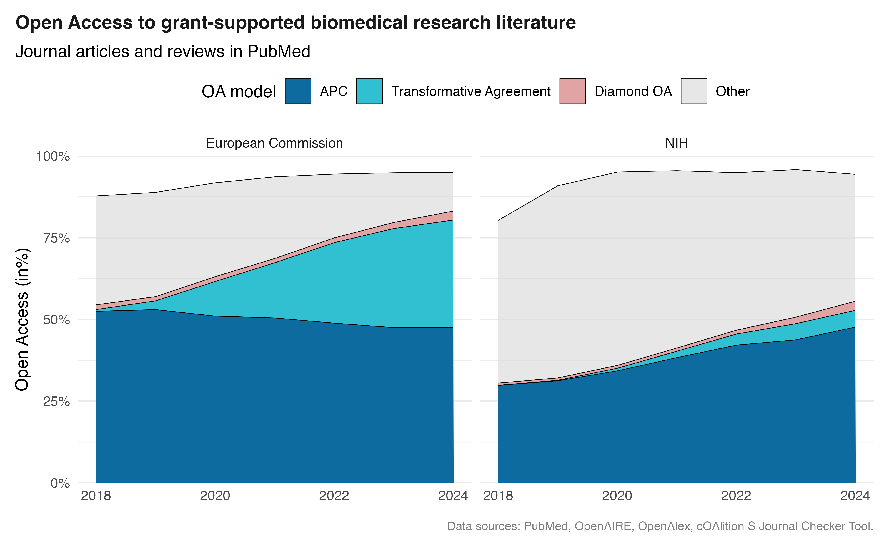

# News & Tutorials

Welcome to our blog featuring news, tutorials, and insights about using BigQuery for open scholarly data analysis.

### [COMET datasets available on ORION-DBs](../blog/posts/comet_datasets/index.llms.md)

[Explore metadata enrichments of arXiv and DataCite](../blog/posts/comet_datasets/index.llms.md)

[The](../blog/posts/comet_datasets/index.llms.md) [COMET](https://www.cometadata.org/) initiative is developing collaborative metadata enrichment practices, including ways for provenanced enrichments to flow into open scholarly metadata sources.

COMET provides open datasets with enrichments to arXiv and DataCite on Zenodo and Huggingface. DataCite enrichments can also be [retrieved through the DataCite API](https://support.datacite.org/docs/metadata-enrichments#retrieve-a-list-of-enrichment-records), but are not (yet) included in DataCite metadata files.

To facilitate broader use of these datasets, including combining them with arXiv and DataCite metadata, various COMET datasets are now provided via ORION-DBs.

Sep 1, 2026

Bianca Kramer

### [ORION-DBs starts FORCE11 working group](../blog/posts/force11-working-group-announcement/index.llms.md)

[Join the public webinar on Sept 4 2026 15:00-16:15 CEST](../blog/posts/force11-working-group-announcement/index.llms.md)

With ORION-DBs, a growing set of actors are hosting large research information datasets in shared spaces, notably in Google BigQuery.

[To coordinate amongst current and future contributors and work towards community standards for discovery, processing, preservation and documentation, we are starting a](../blog/posts/force11-working-group-announcement/index.llms.md) [FORCE11 working group](https://force11.org/group/orion-collective-action-group-for-sharing-and-using-open-research-information-resources-online/).

The working group will also seek to build a community around future alternatives to proprietary cloud systems for data sharing at scale and identify future paths to community-led training and development resources.

Aug 4, 2026

Bianca Kramer

### [Alternatives for what?](../blog/posts/alternatives-to-gbq/index.llms.md)

[Public infrastructure alternatives to Google Big Query - an overview of features](../blog/posts/alternatives-to-gbq/index.llms.md)

There are emerging alternatives to Google Big Query in the cloud and for local computing, and organisations exploring these alternatives or interested in doing so. With ORION-DBs, we hope to spur on these developments and their application for opening up use of scholarly data sets. As a first contribution, in this blog post we discuss some features, or lack thereof, of Google Big Query infrastructure, what they mean for how data are made available and how public infrastructure could strive to emulate or improve these features.

Jul 6, 2026

Bianca Kramer, Cameron Neylon

### [The power of data snapshots - how to make your data work for others](../blog/posts/data-snapshot-requirements/index.llms.md)

[Data snapshot requirements for ORION-DBs](../blog/posts/data-snapshot-requirements/index.llms.md)

If you maintain a data set of open scholarly metadata (e.g. through APIs or full data snapshots) and would like us to consider including your data set in Google Big Query as part of the ORION-DBs collection, this posts outlines the requirements we set out regarding data provision. These include licensing, the availability of a complete data schema, information on versioning and data provenance, and preferred data formats.

Jul 5, 2026

Bianca Kramer, Cameron Neylon

### [Crosswalking ORION resources to measure open access to biomedical research literature](../blog/posts/nih-ec-oa/index.llms.md)

[The role of transformative agreements for NIH- and EC-funded research](../blog/posts/nih-ec-oa/index.llms.md)

This tutorial shows how to combine various ORION resources, with a focus on funder and open access. Using the National Institutes of Health (NIH) and the European Commission (EC) as examples, it draws on data from PubMed, OpenAIRE, OpenAlex, and transformative agreement data from cOAlition S and ESAC. The analysis covers more than 800,000 biomedical research articles, revealing notable differences in open access funding between NIH- and EC-supported research.

Mar 13, 2026

Najko Jahn, Bianca Kramer, Cameron Neylon, Nick Haupka

### [Sharing the load: Building an open research information collective](../blog/posts/welcome/index.llms.md)

Can we share resources and burdens to make available key open research information resources in actionable and connectable form in the cloud? Through sharing processes and systems, is it possible, over time, to build a standard for how these data sources should be made available?

Feb 16, 2026

Cameron Neylon, Bianca Kramer, Alysson Fernandes Mazoni, Rodrigo Costas, Najko Jahn, Nees Jan van Eck
