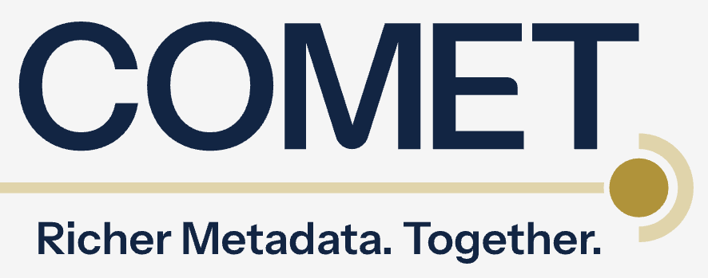

# COMET datasets available on ORION-DBs

Explore metadata enrichments of arXiv and DataCite

news

COMET

metadata enrichment

Author

Bianca Kramer [![](data:image/png;base64,iVBORw0KGgoAAAANSUhEUgAAABAAAAAQCAYAAAAf8/9hAAAAGXRFWHRTb2Z0d2FyZQBBZG9iZSBJbWFnZVJlYWR5ccllPAAAA2ZpVFh0WE1MOmNvbS5hZG9iZS54bXAAAAAAADw/eHBhY2tldCBiZWdpbj0i77u/IiBpZD0iVzVNME1wQ2VoaUh6cmVTek5UY3prYzlkIj8+IDx4OnhtcG1ldGEgeG1sbnM6eD0iYWRvYmU6bnM6bWV0YS8iIHg6eG1wdGs9IkFkb2JlIFhNUCBDb3JlIDUuMC1jMDYwIDYxLjEzNDc3NywgMjAxMC8wMi8xMi0xNzozMjowMCAgICAgICAgIj4gPHJkZjpSREYgeG1sbnM6cmRmPSJodHRwOi8vd3d3LnczLm9yZy8xOTk5LzAyLzIyLXJkZi1zeW50YXgtbnMjIj4gPHJkZjpEZXNjcmlwdGlvbiByZGY6YWJvdXQ9IiIgeG1sbnM6eG1wTU09Imh0dHA6Ly9ucy5hZG9iZS5jb20veGFwLzEuMC9tbS8iIHhtbG5zOnN0UmVmPSJodHRwOi8vbnMuYWRvYmUuY29tL3hhcC8xLjAvc1R5cGUvUmVzb3VyY2VSZWYjIiB4bWxuczp4bXA9Imh0dHA6Ly9ucy5hZG9iZS5jb20veGFwLzEuMC8iIHhtcE1NOk9yaWdpbmFsRG9jdW1lbnRJRD0ieG1wLmRpZDo1N0NEMjA4MDI1MjA2ODExOTk0QzkzNTEzRjZEQTg1NyIgeG1wTU06RG9jdW1lbnRJRD0ieG1wLmRpZDozM0NDOEJGNEZGNTcxMUUxODdBOEVCODg2RjdCQ0QwOSIgeG1wTU06SW5zdGFuY2VJRD0ieG1wLmlpZDozM0NDOEJGM0ZGNTcxMUUxODdBOEVCODg2RjdCQ0QwOSIgeG1wOkNyZWF0b3JUb29sPSJBZG9iZSBQaG90b3Nob3AgQ1M1IE1hY2ludG9zaCI+IDx4bXBNTTpEZXJpdmVkRnJvbSBzdFJlZjppbnN0YW5jZUlEPSJ4bXAuaWlkOkZDN0YxMTc0MDcyMDY4MTE5NUZFRDc5MUM2MUUwNEREIiBzdFJlZjpkb2N1bWVudElEPSJ4bXAuZGlkOjU3Q0QyMDgwMjUyMDY4MTE5OTRDOTM1MTNGNkRBODU3Ii8+IDwvcmRmOkRlc2NyaXB0aW9uPiA8L3JkZjpSREY+IDwveDp4bXBtZXRhPiA8P3hwYWNrZXQgZW5kPSJyIj8+84NovQAAAR1JREFUeNpiZEADy85ZJgCpeCB2QJM6AMQLo4yOL0AWZETSqACk1gOxAQN+cAGIA4EGPQBxmJA0nwdpjjQ8xqArmczw5tMHXAaALDgP1QMxAGqzAAPxQACqh4ER6uf5MBlkm0X4EGayMfMw/Pr7Bd2gRBZogMFBrv01hisv5jLsv9nLAPIOMnjy8RDDyYctyAbFM2EJbRQw+aAWw/LzVgx7b+cwCHKqMhjJFCBLOzAR6+lXX84xnHjYyqAo5IUizkRCwIENQQckGSDGY4TVgAPEaraQr2a4/24bSuoExcJCfAEJihXkWDj3ZAKy9EJGaEo8T0QSxkjSwORsCAuDQCD+QILmD1A9kECEZgxDaEZhICIzGcIyEyOl2RkgwAAhkmC+eAm0TAAAAABJRU5ErkJggg==)](https://orcid.org/0000-0002-5965-6560)

Published

September 1, 2026

Doi

[10.59350/z9n09-6aa44](https://doi.org/10.59350/z9n09-6aa44)

Abstract

The [COMET](https://www.cometadata.org/) initiative is developing collaborative metadata enrichment practices, including ways for provenanced enrichments to flow into open scholarly metadata sources.

COMET provides open datasets with enrichments to arXiv and DataCite on Zenodo and Huggingface. DataCite enrichments can also be [retrieved through the DataCite API](https://support.datacite.org/docs/metadata-enrichments#retrieve-a-list-of-enrichment-records), but are not (yet) included in DataCite metadata files.

To facilitate broader use of these datasets, including combining them with arXiv and DataCite metadata, various COMET datasets are now provided via ORION-DBs.



## COMET projects

Together with community partners, COMET is carrying out [various projects](https://www.cometadata.org/projects/) aimed at developing methods for enriching various elements in existing open scholarly metadata collections. Completed projects include:

- Matching preprints to published articles

- Improving affiliations parsing of preprints

- Extracting funding metadata from acknowlegdments

All three projects were piloted using arXiv preprints.

## DataCite enrichments

Apart from standalone datasets as project results, COMET also provides enrichments to DataCite DOI metadata, using a standardized format compatible with DataCite metadata schema. These enrichments extend the methodology developed in COMET projects to a wider corpus of metadata.

Currently, three types of enrichments of DataCite DOI metadata are made available:

- matching affiliations

- identifying and matching funders

- improving resource type classification

### Supporting usage and interoperability

COMET makes these datasets available as JSON, CSV and/or Parquet files via [Zenodo](https://zenodo.org/communities/comet2025/) and [Huggingface](https://huggingface.co/cometadata). The enriched DOI metadata can also be [retrieved via the DataCite API](https://www.cometadata.org/blog/comet-enrichments-now-available-in-datacite/), but are not (yet) included in DataCite and arXiv metadata files.

To promote usage of these enriched metadata,various COMET metadata files are now made available through ORION-DBs (provided by [Sesame Open Science](https://orion-dbs.community/collections/sos/)), where they can be queried using Google Big Query.

These datasets can also be directly combined with DataCite and arXiv at scale, using the data snapshots similarly provided through ORION-DBs.

### Available datasets

The following datasets are available (follow links for documentation)

- [**COMET project results**](https://codeberg.org/TwoBirds/metadata_ingest#comet-project-results)
  - arXiv preprint matching
  - arXiv preprint author affiliation extraction
  - arXiv funding entity extractions
- [**COMET DataCite enrichments**](https://codeberg.org/TwoBirds/metadata_ingest#comet-enrichments)
  - affiliations
  - funders
  - resource types
- [**DataCite**](https://codeberg.org/TwoBirds/metadata_ingest#datacite)
  - DataCite monthly data file
- [**arXiv**](https://codeberg.org/TwoBirds/metadata_ingest#arxiv)
  - arXiv metadata file (retrieved from [Kaggle](https://www.kaggle.com/datasets/Cornell-University/arxiv/data))

### Share your ideas!

Do you have ideas on how to use these datasets to explore community-enriched metadata? We would love to know your use cases - let us know at <info@orion-dbs.community>, or [Dione Mentis](mailto:dione.mentis@datacite.org) and [Adam Buttrick](mailto:adam.buttrick.ucop.edu) at COMET!

## Citation

BibTeX citation:

``` quarto-appendix-bibtex
@online{kramer2026,
  author = {Kramer, Bianca},
  title = {COMET Datasets Available on {ORION-DBs}},
  date = {2026-09-01},
  url = {https://orion-dbs.community/blog/posts/comet_datasets/},
  doi = {10.59350/z9n09-6aa44},
  langid = {en},
  abstract = {The {[}COMET{]}(https://www.cometadata.org/) initiative is
    developing collaborative metadata enrichment practices, including
    ways for provenanced enrichments to flow into open scholarly
    metadata sources. COMET provides open datasets with enrichments to
    arXiv and DataCite on Zenodo and Huggingface. DataCite enrichments
    can also be {[}retrieved through the DataCite
    API{]}(https://support.datacite.org/docs/metadata-enrichments\#retrieve-a-list-of-enrichment-records),
    but are not (yet) included in DataCite metadata files. To facilitate
    broader use of these datasets, including combining them with arXiv
    and DataCite metadata, various COMET datasets are now provided via
    ORION-DBs.}
}
```

For attribution, please cite this work as:

Kramer, Bianca. 2026. “COMET Datasets Available on ORION-DBs.” ORION-DBs Blog, September 1. <https://doi.org/10.59350/z9n09-6aa44>.
